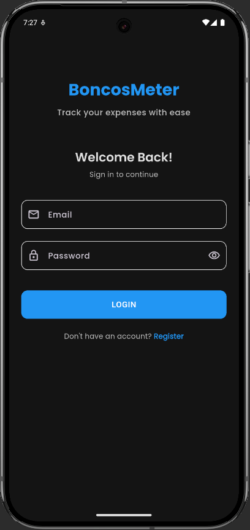
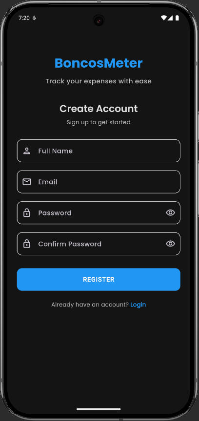
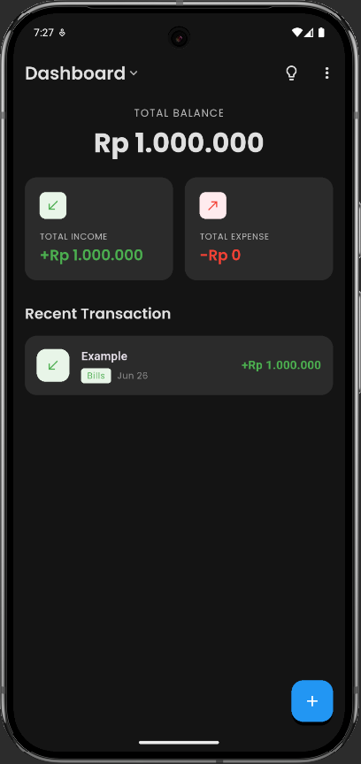
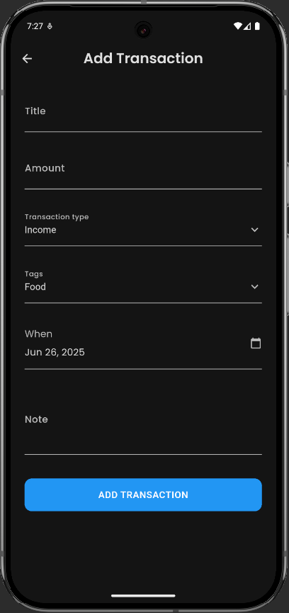
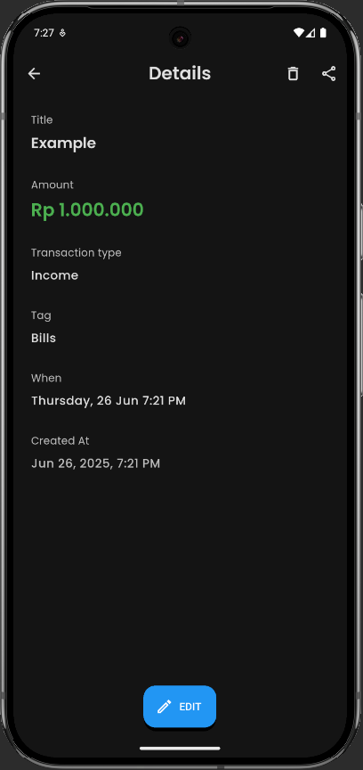

# BoncosMeter 💰

**BoncosMeter** adalah aplikasi mobile untuk pencatatan dan pengelolaan keuangan pribadi yang membantu pengguna melacak pemasukan dan pengeluaran dengan mudah dan efisien.

## 📱 Deskripsi Project

BoncosMeter adalah aplikasi expense tracker yang dibangun menggunakan Flutter dengan fitur-fitur lengkap untuk manajemen keuangan:

### ✨ Fitur Utama:
- 🔐 **Autentikasi User** - Registrasi, login, dan logout
- 💸 **Pencatatan Transaksi** - Input pemasukan dan pengeluaran
- 📊 **Dashboard** - Overview saldo, total income, dan total expense
- 🔍 **Search & Filter** - Cari transaksi berdasarkan judul, tag, atau catatan
- 💱 **Multi Currency** - Dukungan berbagai mata uang internasional
- 🌙 **Dark/Light Mode** - Toggle theme sesuai preferensi
- 👤 **Profile Management** - Edit profil, ganti password, delete account
- 📱 **Responsive UI** - Desain yang adaptif untuk berbagai ukuran layar

### 🏗️ Arsitektur:
- **Framework**: Flutter
- **State Management**: Provider Pattern
- **Architecture**: Clean Architecture dengan separation of concerns
- **Storage**: SharedPreferences untuk data lokal
- **Routing**: GoRouter untuk navigasi
- **Theming**: Material Design dengan custom themes

## 🚀 Cara Menjalankan Program

### Prerequisites
Pastikan Anda sudah menginstall:
- [Flutter SDK](https://flutter.dev/docs/get-started/install) (versi 3.10.0 atau lebih baru)
- [Dart SDK](https://dart.dev/get-dart) (biasanya sudah include dengan Flutter)
- IDE: [Android Studio](https://developer.android.com/studio) atau [VS Code](https://code.visualstudio.com/)
- [Git](https://git-scm.com/) untuk clone repository

### Step-by-Step Installation:

#### 1. Clone Repository
```bash
git clone https://github.com/rizal-ramadhan/boncos_meter.git
cd boncos_meter
```

#### 2. Install Dependencies
```bash
flutter pub get
```

#### 3. Verify Flutter Installation
```bash
flutter doctor
```
Pastikan semua checklist berwarna hijau atau tidak ada issues critical.

#### 4. Connect Device/Emulator
- **Physical Device**: Enable Developer Options dan USB Debugging
- **Emulator**: Buka Android Studio > AVD Manager > Create/Start Virtual Device

#### 5. Check Connected Devices
```bash
flutter devices
```

#### 6. Run Application
```bash
# Run in debug mode
flutter run

# Run in release mode
flutter run --release

# Run on specific device
flutter run -d <device_id>
```

### 📦 Build APK (Optional)
```bash
# Build debug APK
flutter build apk

# Build release APK
flutter build apk --release

# APK akan tersedia di: build/app/outputs/flutter-apk/
```

### 🛠️ Development Commands
```bash
# Hot reload (during development)
r

# Hot restart
R

# Quit
q

# Clean build
flutter clean
flutter pub get
```

## 📁 Struktur Project

```
lib/
├── core/
│   ├── constants/
│   │   ├── app_colors.dart
│   │   └── app_themes.dart
│   └── router/
│       └── app_router.dart
├── data/
│   ├── models/
│   │   ├── user_model.dart
│   │   ├── transaction_model.dart
│   │   └── currency_model.dart
│   └── services/
│       ├── auth_service.dart
│       ├── transaction_service.dart
│       └── currency_service.dart
├── presentation/
│   ├── providers/
│   │   ├── auth_provider.dart
│   │   ├── transaction_provider.dart
│   │   ├── currency_provider.dart
│   │   └── theme_provider.dart
│   ├── screens/
│   │   ├── auth/
|   │   │   ├── auth_wrapper.dart
|   │   │   ├── login_screen.dart
|   │   │   └── register_screen.dart
│   │   ├── dashboard/
|   │   │   └── dashboard_screen.dart
│   │   ├── transactions/
|   │   │   ├── add_transaction.dart
|   │   │   ├── all_expense_screen.dart
|   │   │   ├── all_income_screen.dart
|   │   │   └── transaction_detail_screen.dart
│   │   ├── profile/
|   │   │   ├── change_password_screen.dart
|   │   │   ├── delete_account_screen.dart
|   │   │   ├── edit_profile_screen.dart
|   │   │   └── profile_screen.dart
│   │   └── settings/
|   │       └── currency_screen.dart
│   └── widgets/
|   │   │   ├── balance_card.dart
|   │   │   ├── common_toolbar.dart
|   │   │   ├── recent_transaction.dart
|   │   │   ├── screen_dropdown.dart
|   │   │   ├── search_dialog.dart
|   │   │   ├── summary_cards.dart
|   │   │   └── transaction_list_item.dart
└── main.dart
```

## 👥 Anggota Kelompok

| Nama Lengkap                | NRP          | Role                             |
|-----------------------------|--------------|----------------------------------|
| [Dovy Adeeb Farizky]        | [5026221033] | Frontend & Backend Developer     |
| [Ferdiansyah Yusuf M.]      | [5026221152] | Frontend & Backend Developer     |
| [Candleline Audrina Firsta] | [5026221159] | Frontend & Backend Developer     |
| [Keysha Alivanno P.R.]      | [5026221178] | Frontend & Backend Developer     |
| [Rizal Ramadhan ]           | [5026221199] | Project Manager, UI/UX Designer, |
|                             |              | Frontend & Backend Developer,    |
|                             |              | Mobile Developer & QA Tester     |

## 📸 Screenshots

### 🔐 Authentication
| Login | Register | Profile |
|-------|----------|---------|
|  |  |  |

### 💰 Main Features
| Dashboard | Add Transaction | Detail Transactions |
|-----------|-----------------|---------------------|
|  |  |  |

## 🎯 Future Enhancements

- 📈 **Analytics & Charts** - Visualisasi data keuangan
- 📅 **Calendar View** - Lihat transaksi per tanggal
- 💾 **Export Data** - Export ke CSV/PDF
- 🔔 **Notifications** - Reminder untuk input transaksi
- ☁️ **Cloud Sync** - Sinkronisasi data online
- 📊 **Budget Planning** - Fitur budgeting dan goals

## 📄 License

This project is licensed under the MIT License - see the [LICENSE](LICENSE) file for details.

## 🤝 Contributing

1. Fork the Project
2. Create your Feature Branch
3. Commit your Changes
4. Push to the Branch
5. Open a Pull Request

## 📞 Contact

Jika ada pertanyaan atau issues, silakan hubungi:
- 📧 Email: [rizalramadhan.email@gmail.com]

---

**Made with ❤️ by [Kelompok 11] - [TEKBER A] - [2025]**